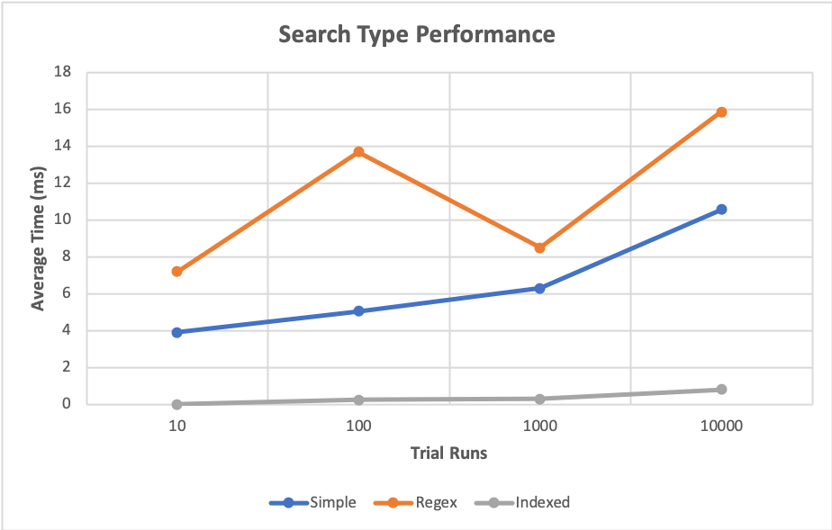

# DocuSearch

## Background
DocuSearch is a case study that examines three text search techniques given a constraint of matching an exact search term
or phrase:
- Simple (in-order, in-line) matching
- Regex matching
- Index searching

While the first two techniques are well-defined, index searching is up to interpretation as some type of index needs to be created
by pre-processing the document files and utilize it for searching.

## Requirements
The following requirements are recommended to run the project locally:

### Running
- Docker
- docker-compose

### Development
- Java 8
- virtualenv
- Python 3.6
- Maven

## Usage
### Running
The following scripts are available in the `bin` folder to build and run DocuSearch:
- `build-docker-image.sh`: Builds a new image with an artifact from the current codebase.
- `start-docusearch.sh`: Starts a container running DocuSearch on `http://localhost:9000`.
- `remove-docusearch.sh`: Kills and removes DocuSearch containers.

### Functional tests
To run the functional tests, first ensure that [`virtualenv`](https://pypi.org/project/virtualenv/) is installed. 
Navigate to `functional_tests/` and run the `bootstrap.sh` script to initialize your virtual environment.

To run the tests:
- Activate your virtual environment (in the `functional_tests` directory): `source .virtualenv/bin/activate`
- Run the tests using `./run_tests.py`
- Deactivate your virtual environment

Note: If any of the dependencies in `requirements.txt` change, `bootstrap.sh` should be run again.

## Design
The design of DocuSearch was intended to make the three search techniques have as similar behavior as possible while adhering to the
constraints of providing an "exact term or phrase." The following behaviors are shared between the search methods:
- Case-sensitivity matching
- Phrase matching
- Partial (phrase) matching

The first two search techniques are fairly concrete in definition, as a simple search is typically an exact string comparison
and regular expressions between different programming languages share a very similar interpretation. Since there is flexibility
with how document files are pre-processed and indexed, we will take a deeper dive into how the approach was determined.

### Data Structure
#### Dictionary

A very straight-forward approach is to parse using a whitespace delimiter into a dictionary (i.e. word map) from a word to a total count.
This allows us constant time lookups for single words, but doesn't easily allow for partial matching like the other search techniques do.

One alternative is to have all substrings of a word added to the dictionary at the cost of space. 

#### Trie

An improvement on the dictionary is to use a trie, which is a specialized prefix tree that maps contiguous letters of words, all linked
to a root node which is used to search. Tries are efficient in that they also allow us to determine if there is a prefix match.

However, the same challenge of partial matching against a suffix exists. Also, tries are traditionally implemented using a character array
for a 26-letter English alphabet, which does not lend itself very flexible for Unicode. 

#### Customized Trie

An improvement on the trie is to add extra information that would optimize lookups at the cost of space. A counter can be maintained
on each node to track the total matches to that level. An array of positions can also be stored, which is inherently ordered
due to the top-to-bottom, left-to-right order in which they are processed.

A hash map was swapped for an array to maintain the children as it has the benefit of growing to the size that it needs
in addition to being able to support Unicode in a scaling manner. Another change is also adding all possible suffixes as mentioned above to fully support partial matching.

#### Max Heap
A max heap is used to aggregate the search results from each document since it is more efficient than populating an array and then
sorting. A custom comparator is also used to resolve conflicts, resulting in the following sort order: total occurrences (high-to-low), sort
name (lowercase document name).  

## Architecture
DocuSearch is designed as a web application since it made the most sense when considering that applications and users would
want to interact and interface with the application rather than setting up the application and storing all of the documents locally.

Although only index searching requires pre-processing, it makes sense to normalize the input files however we wish and also keep
the normalized data in memory for faster lookups than if file reads were required for every simple string or regex search. Currently 
carriage return (`\r`), new-line (`\n`), and tab (`\t`) characters are replaced with whitespace and contiguous whitespace is consolidated.

I also decided to maintain tries separately for each document since as more documents get added, the larger the data structure grows
and theoretically may reach the point where it can't be easily maintained in a single structure. Maintaining separate tries at the
document level also provides the potential for updating a pre-processed index for an existing document as it wouldn't be super
tightly coupled.

### Searching Algorithm
By nature, characters are stored as lowercase (including Unicode) to support case-insensitive lookup. To allow case-sensitive
comparison for search results, a verification is performed for each identified position when traversing the trie to confirm case matching.
There was no compelling reason to store extra information about the exact string in the trie, but may be considered in the future
if benchmarks prove usefulness.

Since each node in the trie tracks the position of the character, a phrase match can be found by simply continuing on from the position
of the word (and also verifying the word, if matching case-sensitivity).

## Future Enhancements
### Design/Features
- Database: A database can be utilized to store serialized blobs of pre-processed data so that they do not need to be computed
every time the application starts up. This is also useful to maintain consistency if there are multiple instances of the application
running.
- Configuration: Character normalization and word character delimiter should be configurable for greater flexibility. Users should be
able to specify case-sensitivity for indexed word search rather than it being application code-specific.
- Full-word support: Contrary to partial phrase matching, users may want to find only full words.
- Concurrency: Since document searching is individual to the document, multiple document searches can be processed simultaneously
with their results aggregated and processed at the end.
- Document uniqueness: Support a better way identify documents.

### Developer Quality-of-Life Enhancements
- Continuous Integration: Continuous integration can be configured for this open-source repository as a precautionary measure
to ensure that regression testing succeeds.
- The functional tests can implement PyTest to add reporting as well as more graceful error handling of functional tests.

## Analysis
### Benchmarks
A rudimentary benchmarking technique was used where the benchmark was run against a Docker container on the same computer, so
there are potentially factors that affected the speed of the results. However, when running the search types with a different of
trial runs, it was clear that the speed ranking is as follows: indexed, simple, regex.

Search Type | Trial Runs | Time (ms) |
----------- | ---------: | --------: |
simple      | 10         | 3.9       |
regex       | 10         | 7.2       |
indexed     | 10         | 0.0       |
simple      | 100        | 5.04      |
regex       | 100        | 13.68     |
indexed     | 100        | 0.25      |
simple      | 1000       | 6.30      |
regex       | 1000       | 8.48      |
indexed     | 1000       | 0.30      |
simple      | 10000      | 10.56     |
regex       | 10000      | 15.86     |
indexed     | 10000      | 0.81      |

A visual aid for the benchmark:

These performance metrics make sense because regex is a greedier search algorithm and requires compiling in addition to specialized
matching. Simple string search is fast because at most, each character is visited once giving the order of O(N) time complexity.

The indexed search trie construction that used in this implementation takes O(N2) time complexity. However, it 
makes up for this in constant lookup time (in relation to the size of the search text) as it simply has to traverse the trie for the
initial word lookup and then compare each position for a matching phrase or case sensitive verification. The key is that a trie
targets only the necessary sections of a text to search for a word. An indexed method will also work more efficiently with unique
words.

One realization of note is that working with this low-level of micro-benchmarking, we may find more accurate results using a
micro-benchmark library such as Java Microbenchmark Harness (JMH). 

## Maintainers
Michael Ly
